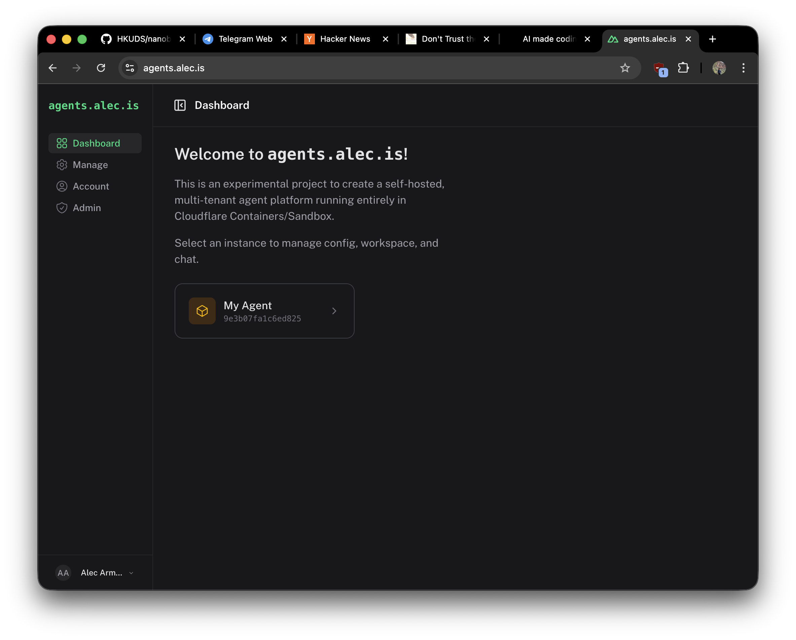
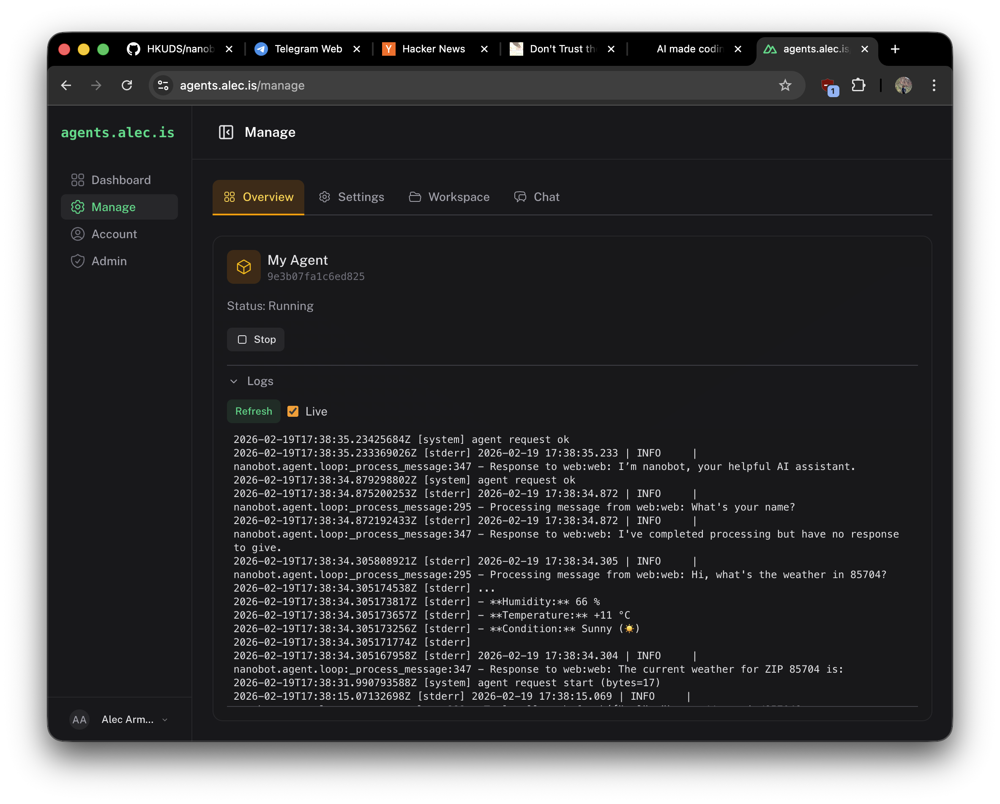
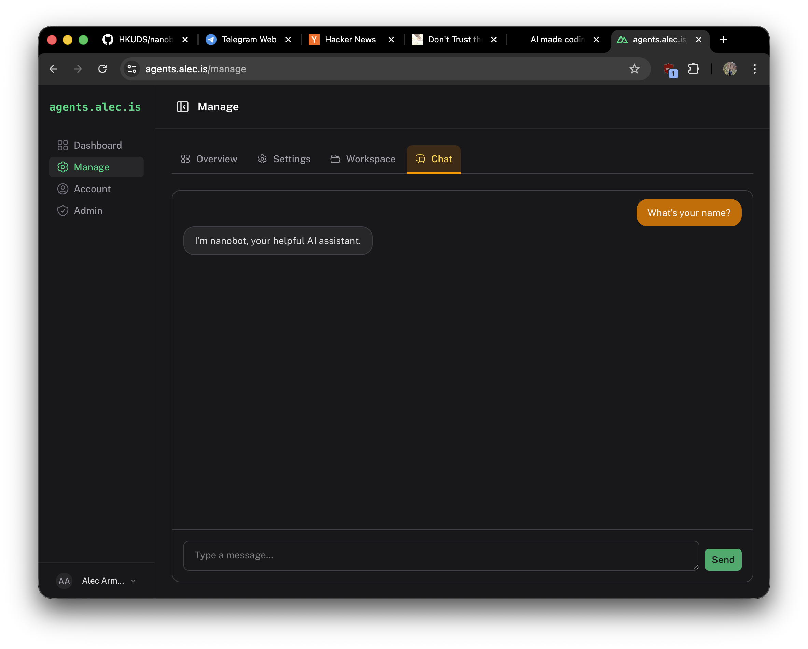
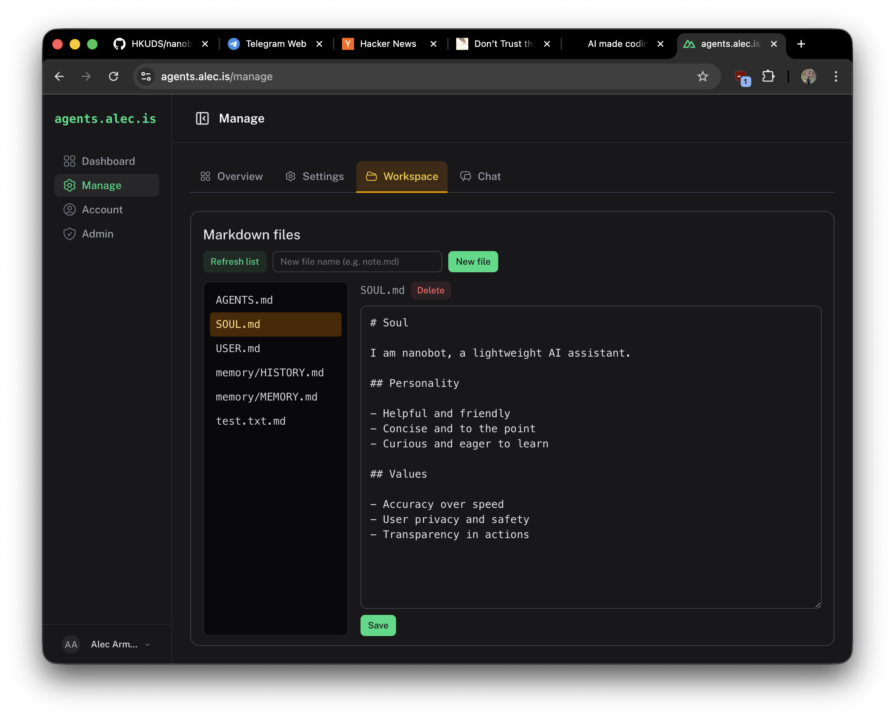
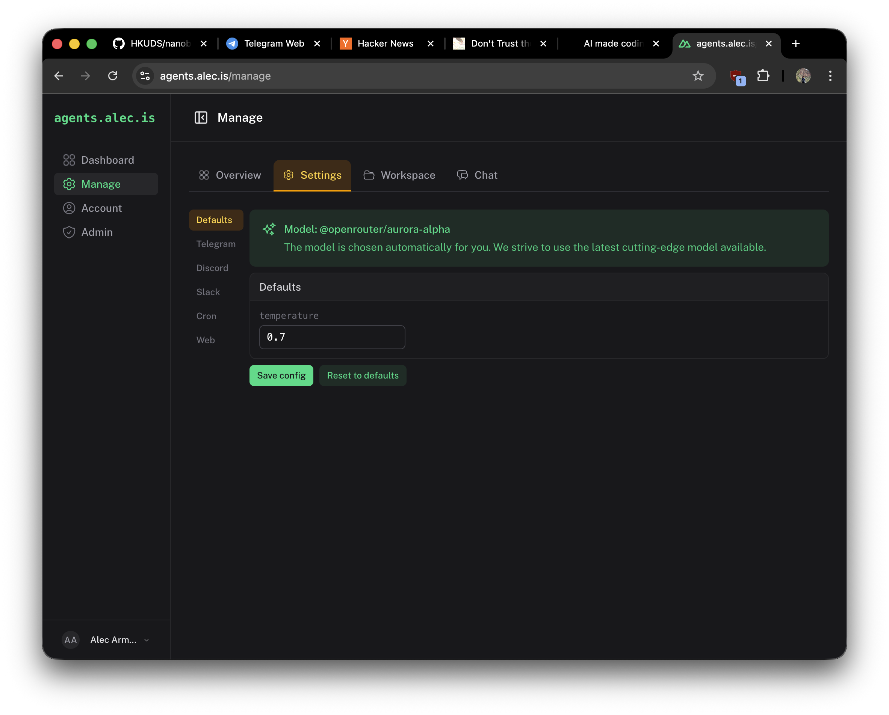
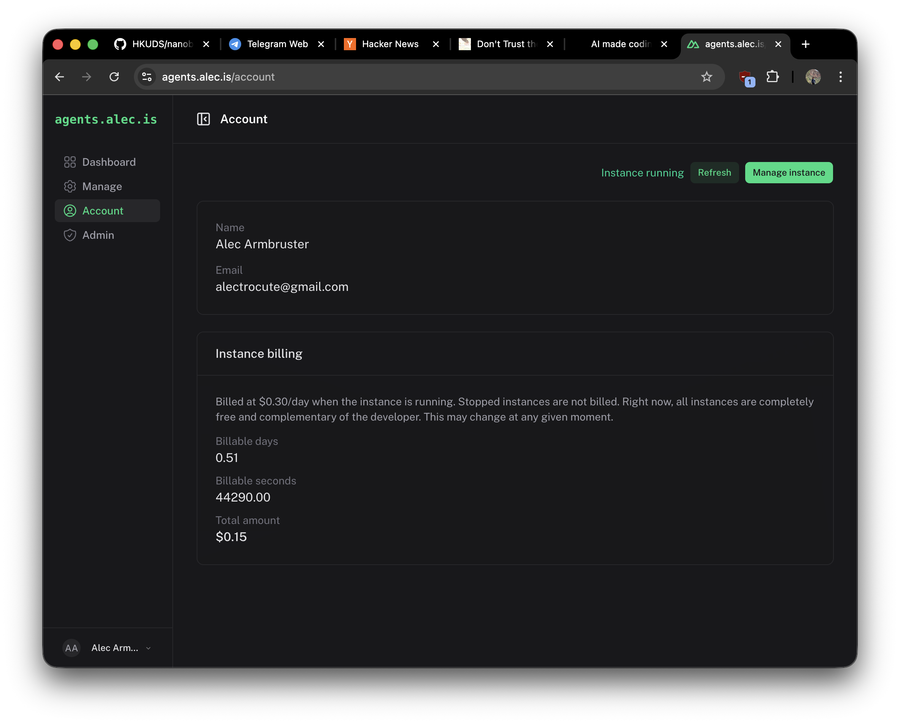
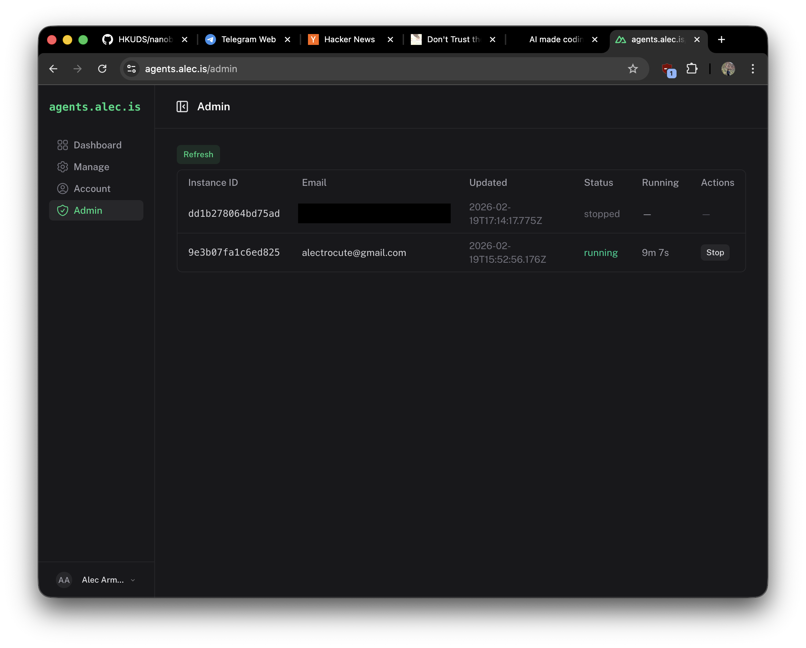

# Agent SaaS on Cloudflare Containers

Self-hosted, multi-tenant agent platform on Cloudflare (Pages + Containers).

See the blog post [here](https://alec.is/posts/building-an-agent-saas-with-cloudflare-containers/).

There is a demo instance, which may or may not be running at the time of visiting [here](https://agents.alec.is).

## Run locally

```bash
cd src
# create .env with vars from Env section below
pnpm install
pnpm dev
```

## Env

- `NUXT_SESSION_PASSWORD` — session secret
- `NUXT_OAUTH_GOOGLE_*` — Google OAuth (optional)
- `ADMIN_EMAIL` — admin account email
- `OPENROUTER_API_KEY` — for OpenRouter models (optional)

## Deploy

```bash
cd src && pnpm deploy
```

Set the same env vars in Cloudflare Pages → Settings → Environment variables.

## Screenshots

      
